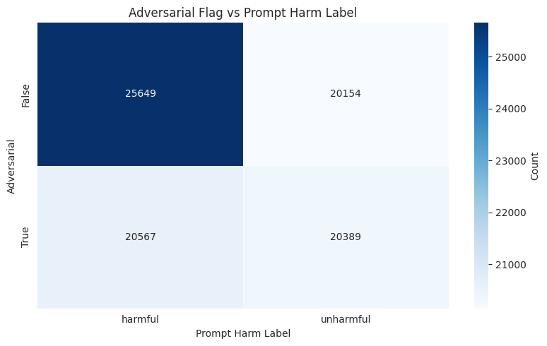
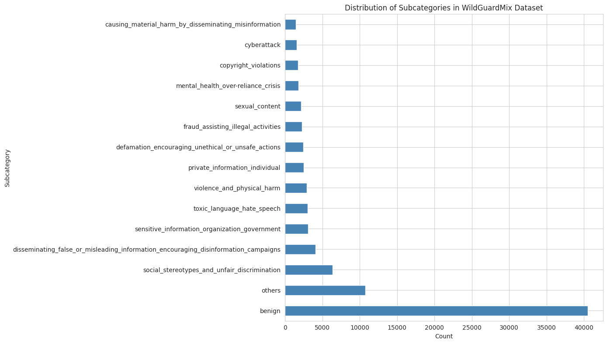
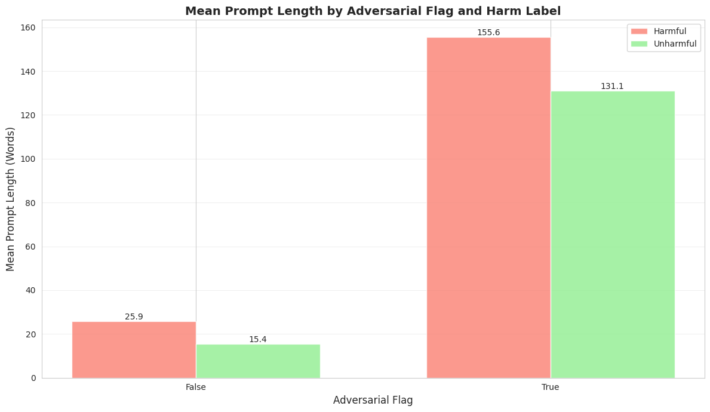

# WildGuardMix (Train Subset)

## Important columns

- `prompt` (text): the input prompt we classify.
- `prompt_harm_label`: target label for whether the prompt is harmful (our primary target).
- `adversarial` (bool): whether the prompt was adversarially generated or modified.
- `subcategory`: fine-grained label for harmful prompts.

## Adversarial vs prompt label

Adversarial does not imply harmful. Keeping `adversarial` in the stratification key captures adversarial-but-unharmful as well as adversarial-and-harmful examples.

## Subcategory distribution

- 15 subcategories
- Benign is the majority class
- 13 dedicated harmful subcategories
- 1 catch-all harmful subcategory

The subcategory distribution motivates stratification — several subcategories are rare and would be underrepresented without stratified sampling.

## Stratification

We stratified on a combined key made from `prompt_harm_label`, `adversarial`, and `subcategory` to preserve joint proportions across splits. This ensures rare subcategories and intersections (for example, adversarial-but-unharmful) are represented in train, validation and test.

## Splits

- Training: 80% (~69k samples)
- Test (held-out for annotation/evaluation): 20% (~17k samples)
- Training set further split: Train=90% / Val=10% (used for limited hyper-parameter tuning)

## Prompt length & adversarial prompts

Prompt lengths (in words) differ by label and adversarial status: harmful prompts are generally longer, and adversarial prompts are substantially longer on average. This informed our max-length decision.

- Observation: harmful prompts trend longer; adversarial prompts are much longer.
- Choice: max prompt length = **256 tokens** (≈192 words) assuming 1 word ≈ 1.33 tokens. 92% of prompts fit within this limit.

## Response-related fields

The dataset includes response-level columns (e.g., `response_refusal_label`, `response_harm_label`) but many samples lack response annotations. We preserve these columns, but they are not used for prompt-intent annotation.

## Reproducibility

- Random seed: 42
- Tools: scikit-learn 1.7.2, pandas, datasets
