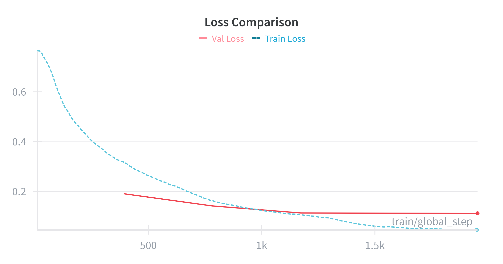

# Training: Harmful Prompt Classification

## Why ModernBERT
ModernBERT was chosen because it consistently improves downstream results versus the BERT family while matching or exceeding baselines in the paper's evaluations. Those empirical gains motivated using `answerdotai/ModernBERT-base` for this classifier.

<!-- ModernBERT (paper) — primary results table (Base models) -->

| Model | BEIR (DPR) | MLDR_OOD (DPR) | MLDR_ID (DPR) | BEIR (ColBERT) | MLDR_OOD (ColBERT) | GLUE | CSN | SQA |
|---|---:|---:|---:|---:|---:|---:|---:|---:|
| BERT | 38.9 | 23.9 | 32.2 | 49.0 | 28.1 | 84.7 | 41.2 | 59.5 |
| RoBERTa | 37.7 | 22.9 | 32.8 | 48.7 | 28.2 | 86.4 | 44.3 | 59.6 |
| DeBERTaV3 | 20.2 | 5.4 | 13.4 | 47.1 | 21.9 | 88.1 | 17.5 | 18.6 |
| NomicBERT | 41.0 | 26.7 | 30.3 | 49.9 | 61.3 | 84.0 | 41.6 | 61.4 |
| GTE-en-MLM | 41.4 | **34.3** | **44.4** | 48.2 | 69.3 | 85.6 | 44.9 | 71.4 |
| ModernBERT | **41.6** | 27.4 | 44.0 | **51.3** | **80.2** | **88.4** | **56.4** | **73.6** |

- Model size: ModernBERT-base ≈ 150M parameters.

## Data used
We train on the training set and (manually) optimize hyper-parameters using the validation set.

## Important hyper-parameters
The canonical configuration lives in `configs/train_config.yaml`; key values used for experiments are:

- `model.name`: `answerdotai/ModernBERT-base`
- `model.max_length`: 256
- `training.num_train_epochs`: 3
- `training.per_device_train_batch_size`: 96
- `training.learning_rate`: 1e-4
- `training.lr_scheduler_type`: `cosine`
- `training.warmup_ratio`: 0.1
- `training.optim`: `adamw_bnb_8bit`
- `training.torch_compile`: true
- Precision: bfloat16 (bf16)

We log all runs and metrics to Weights & Biases (wandb).

## Training progress
Training and validation loss both plateaued at the end of training (see figure below):

## Final results (Test Set)
- `Accuracy`: 95.9
- `F1 Score`: 96.2

The trained model and annotation set have been uploaded to Hugging Face:
- Model: `Jazhyc/modernbert-wildguardmix-classifier`
- Test set with model probabilities: `Jazhyc/wildguardmix-annotations`
