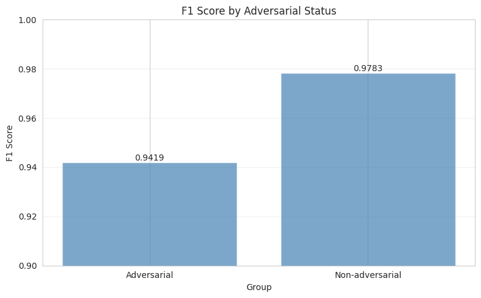
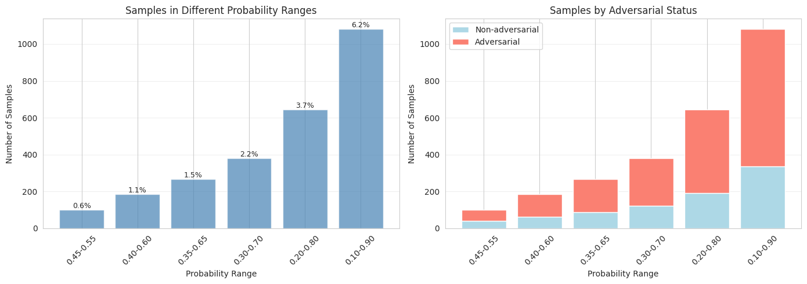

# Data filtration and selection for annotation

We used the trained ModernBERT classifier to analyze the held-out test set and pick hard examples for manual intent annotation.

## Held-out test analysis
Classifier performance was lower on adversarial prompts (see plot).  
The plot below shows `test_adversarial_f1` (adversarial vs non-adversarial F1):

## Selecting borderline examples
We selected samples where the classifier's probability for the "harmful" class (i.e., harmful-probability) was near 0.5. Concretely, we exported all examples with harmful-probability in the range [0.1, 0.9] for review. Counts for the narrower windows (around 0.5) are shown below:

Adversarial prompts were overrepresented in these filtered sets, confirming they are harder for the classifier.

## Annotation
The exported borderline examples were imported into Label Studio for manual intent annotation.

